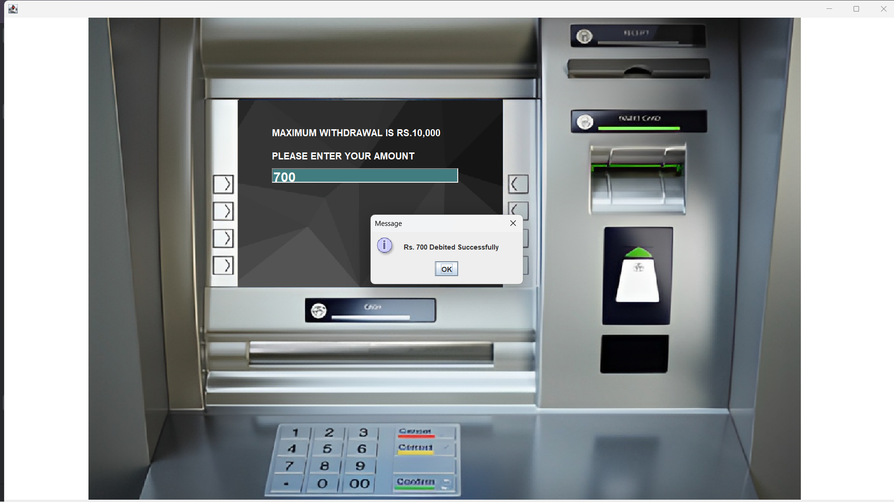
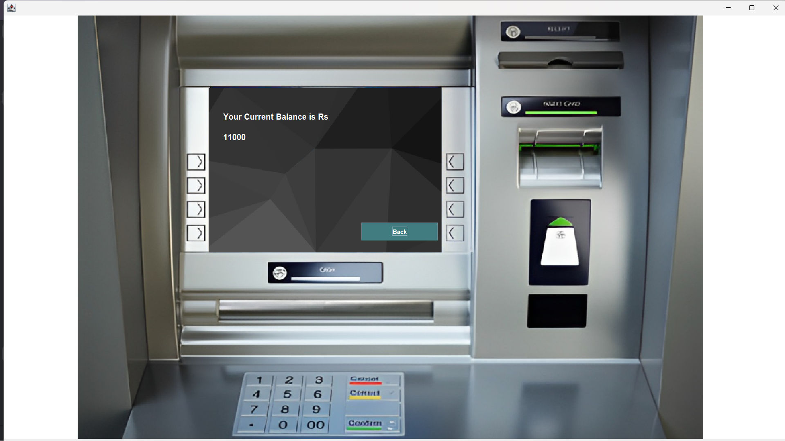

# Java ATM Application

This Java-based ATM (Automated Teller Machine) application simulates the functionality of an ATM for banking transactions. The application includes various screens and user interfaces to perform tasks such as logging in, depositing funds, withdrawing cash, checking account balances, and viewing transaction history.

## Features

- **User Authentication**: Secure login using card number and PIN.
- **Transaction Options**: 
  - Deposit funds
  - Withdraw cash
  - Check account balance
  - View transaction history (mini statement)
  - Quick cash withdrawal with predefined options

## Screens

1. **Login Screen**: 
   - Provides the user interface for logging into the ATM system.
   - Users enter their card number and PIN to access their accounts.
   - Successful login redirects users to the main menu.

   

2. **Main Screen**: 
   - Presents users with a menu to select different banking transactions.
   - Options include deposit, withdrawal, balance inquiry, mini statement, and exit.

   

3. **Deposit Screen**: 
   - Users can deposit funds into their accounts by specifying the amount.
   - The application records transaction details and updates the account balance.

   

4. **Withdraw Screen**: 
   - Allows users to withdraw cash from their accounts by specifying the amount.
   - Verifies account balance before processing withdrawals.

   

5. **Balance Enquiry Screen**: 
   - Displays the user's account balance retrieved from the database.

   

6. **Fast Cash Screen**: 
   - Provides predefined withdrawal options for quick transactions.

   

7. **Mini Statement Screen**: 
   - Displays a mini statement of recent transactions with details like date, type, and amount.

   

## Technologies Used

- **Java Swing**: GUI toolkit for developing Window-Based Applications in Java.
- **Java AWT**: Library for creating graphical components and handling events.
- **JDBC (Java Database Connectivity)**: Connects to a MySQL database to store and retrieve data related to ATM transactions.
- **MySQL**: Relational database management system for storing user accounts and transaction information.

## Installation

1. Clone the repository:
   ```bash
   git clone <repository-url>
